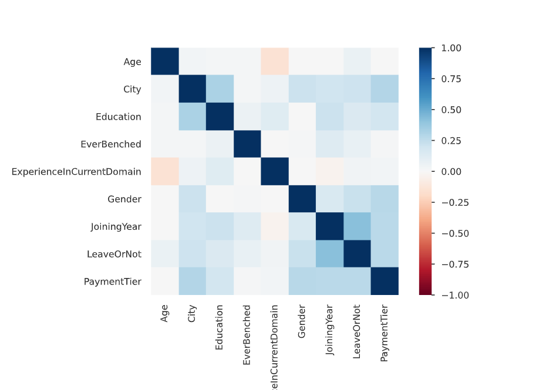
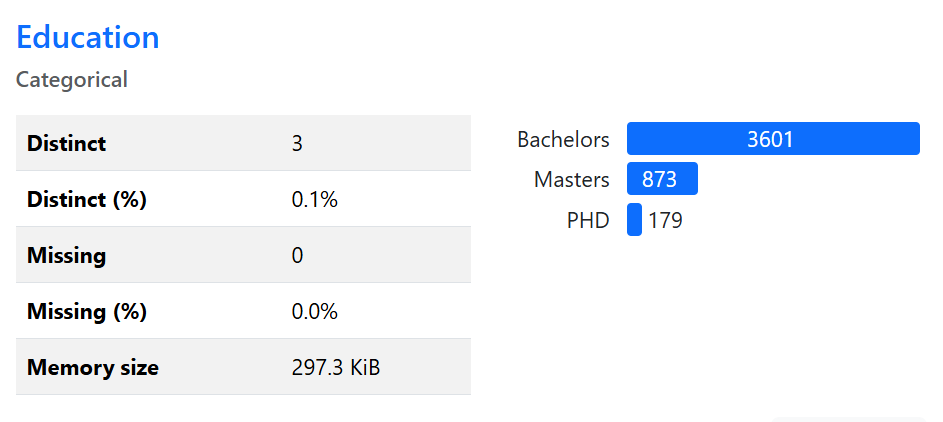
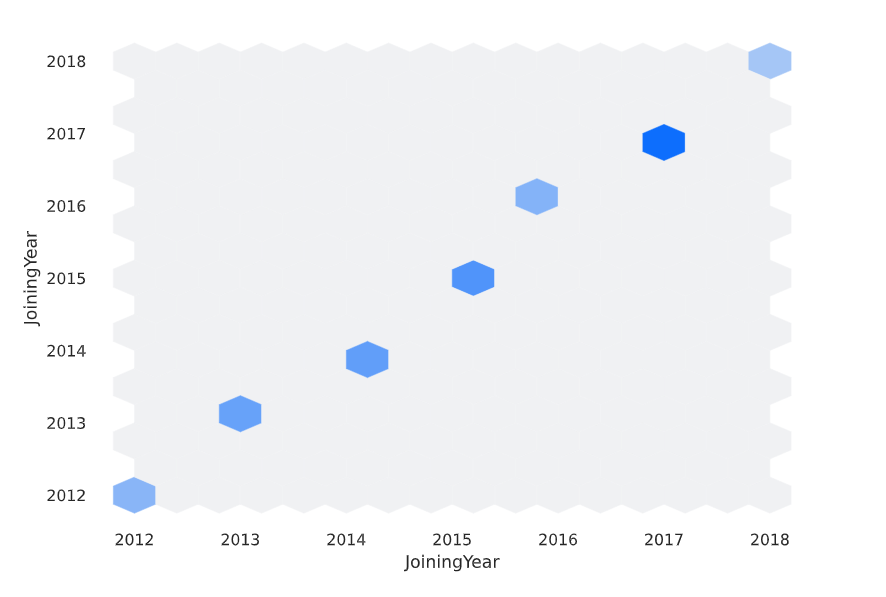
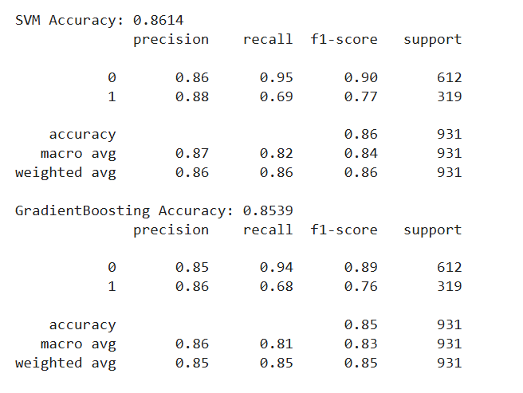
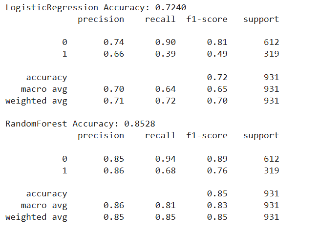

# CT1-MLOps Group Assignment 

## Problem Statement Recap:  
Our project involved developing a **complete lifecycle** of a **machine learning model**. To achieve this, we chose an **employee dataset** from **Kaggle**, aimed at predicting the likelihood of an employee **leaving the organization**. The dataset contains a variety of **features** that support the creation of a **predictive model** for **employee retention**.
 
## Below are the steps we followed for ML model deployment, including version control, tracking experiments, and building an interactive UI. 

## 1. Dataset Selection
We selected a dataset from **Kaggle** called ([**employee dataset**](https://www.kaggle.com/datasets/tawfikelmetwally/employee-dataset))  
### Context: 
This dataset contains information about **employees** in a company, including their **educational backgrounds**, **work history**, **demographics**, and **employment-related factors**. It has been **anonymized** to protect privacy while still providing valuable insights into the workforce.
## 2.Dataset Schema and Storage:  
- This section details the implementation of an **enhanced data validation function** and its application to a dataset.  
- The workflow ensures the dataset adheres to a **predefined schema**, performing **cleaning** and **validation** before further processing.  
- **Validated and cleaned datasets** are stored in **Parquet format** for **efficient storage** and subsequent processing tasks.  
- Each column in the schema defines the following:  
  - **Type:** Specifies if the column contains **categorical** or **numerical** data.  
  - **Allowed Values:** Defines **permissible values** or **value ranges** for the column.  
  - **Nullable:** Indicates whether **null values** are acceptable.  
## 3. Profiling the Dataset:  
- We generated a **comprehensive profile report** of the dataset using **Pandas Profiling**.  
  - This report provides an **in-depth overview** of the data, including details about **individual variables**, **interactions**, **correlations**, **missing values**, **duplicate rows**, and other **key statistics**.
- It serves as a **valuable tool** for understanding the dataset's **structure** and **quality**, helping to identify **potential issues** and **insights** for further analysis.
- Below are few sample screenshots generated from the profile
- - 
  - 
  - 
## 4.Train-Test Split:  
- In this step, we **split the dataset** into three distinct parts: **training (60%)**, **testing (20%)**, and **production (20%)**.  
- To ensure **consistency** and **reproducibility** of results, we used a **fixed random seed** during the splitting process.  
- The segmented datasets were saved in **Parquet file format** for **efficient storage** and **seamless access** during model development and evaluation.  
## 5.Data Version Control:  
- In this step, we created a **GitHub repository** to maintain a **well-organized** and **version-controlled workspace**.  
- The repository includes:  
  - **Parquet files** for **training**, **testing**, and **production datasets**.  
  - The **original employee dataset** in **CSV format**.  
  - The **generated profile report**.  
- By implementing **version control**, we ensured **seamless collaboration** and **traceability**, maintaining a **structured** and **efficient repository** for future development and reference.  
## 6.ML Pipeline with Scikit-Learn:  
- This section describes a **comprehensive pipeline** to preprocess data, train, and evaluate multiple machine learning models for predicting **employee retention**.  
- The pipeline includes:  
  - Loading **train and test datasets** from GitHub.  
  - Categorizing features (e.g., **categorical:** Education, **numerical:** Age).  
  - Applying transformations like **standard scaling** for numerical features and **one-hot encoding** for categorical ones.  
- **Five models**, including **Logistic Regression**, **Random Forest**, and **Gradient Boosting**, are trained and evaluated using **accuracy scores** and **classification reports**.  
- **Hyperparameter tuning** via **GridSearchCV** optimizes model performance, with the **best models** and their parameters stored for future use.  
- This **structured approach** ensures **consistency**, **systematic optimization**, and **detailed evaluation** of models for effective predictions.
- Below are screenshots of few models covering precision, f1-score etc:
- 
- 
## 7.ML Experimentation and Tracking with MLflow 
This workflow integrates **MLflow** for tracking experiments, logging metrics, and storing artifacts during model training and optimization using K-Fold cross-validation.  
- **Storage & Configuration:** Google Drive provides persistent storage for MLflow’s SQLite backend (mlflow.db) and artifacts. The experiment, "Employee Attrition Analysis," is tracked using a specified URI.  
- **K-Fold Cross-Validation:** Training data is split into five folds to ensure robust evaluation, testing all portions of the data.  
- **Pipeline & Logging:** Preprocessing pipelines and models are combined, with hyperparameter tuning via GridSearchCV when applicable. MLflow logs metrics (accuracy, precision, recall, F1-score), cross-validation results, and model artifacts.  
- **Reproducibility:** MLflow tracks hyperparameters, metrics, and model schemas, enabling reproducibility and performance comparison across models and parameters.  
### Remote Monitoring via MLflow UI 
Using Ngrok, the MLflow UI is securely exposed to a public URL in Colab. This setup allows persistent tracking and remote access to experiments, supporting collaboration and scalability in cloud-based environments. 
## 8.Model Deployment Using FastAPI
The best-performing model, identified from MLflow based on cross-validation or accuracy, is deployed using **FastAPI** to serve real-time predictions via a RESTful API.  
- **Model Loading:** The trained model is loaded from a pickle file.  
- **API Setup:** A FastAPI app defines endpoints for prediction, with input validation handled by Pydantic's `PredictionInput` schema.  
- **Public Accessibility:** The API runs locally on port 8000 in Colab, with Ngrok exposing a secure public URL for remote access.  
This deployment enables scalable, real-time predictions for tasks like employee attrition analysis, supporting collaborative model testing and application integration.
## 9.User Interface Development with Streamlit 
An interactive web app is built using **Streamlit** to predict employee attrition by communicating with a **FastAPI** backend.  
- **User Input:** Users provide details such as education, joining year, age, city, payment tier, gender, benching status, and domain experience. These inputs are sent to the FastAPI model for predictions.  
- **Real-Time Predictions:** The app displays the prediction (Stay or Leave) on the web page.  
- **Enhanced Usability:** Dropdowns, sliders, and robust error handling ensure a seamless user experience, even during connectivity issues.  
This integration of FastAPI and Streamlit delivers a user-friendly interface for real-time predictions, making it accessible and intuitive for stakeholders.  
## 10.Model Monitoring  
This step detects and visualizes **data drift** between training and production datasets to ensure long-term model reliability.  
- **Drift Detection:** The **TabularDrift algorithm** identifies changes in feature distributions using a significance threshold (p-value < 0.05). Features with drift are highlighted, and an overall drift status is reported.  
- **Visualization:**  
  - **KDE plots** for numerical features.  
  - **Bar charts** for categorical features.  
  These enable side-by-side comparison of training and production datasets.  
This monitoring process supports timely interventions to maintain model accuracy and dependability over time.

